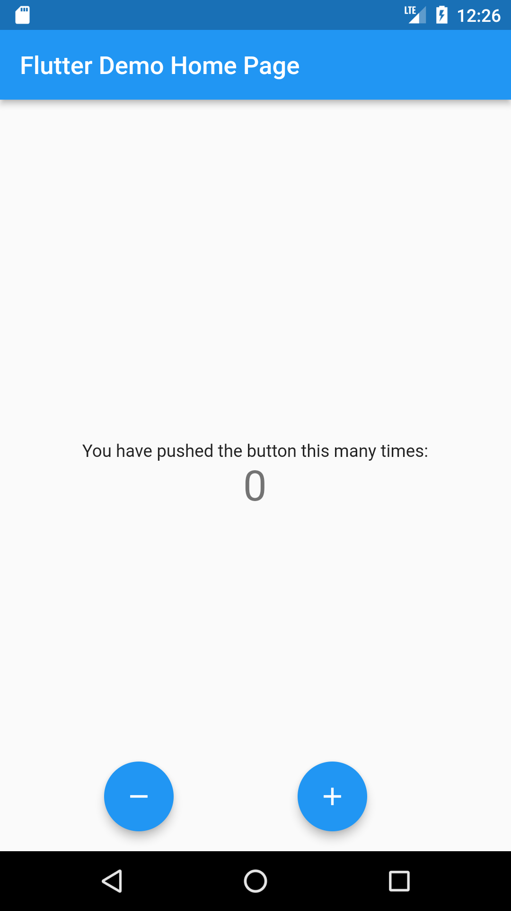

# bloc_sample_counterapp
a simple counter app using bloc.incremnt and decrement value by button press.
 
  - flutter_bloc: 8.0.1
  - freezed_annotation: 1.1.0
  - build_runner: 2.1.7
  - freezed: 1.1.1
   
  
For adding packages use [Pub.dev](https://pub.dev/packages)
  
  
## UI

